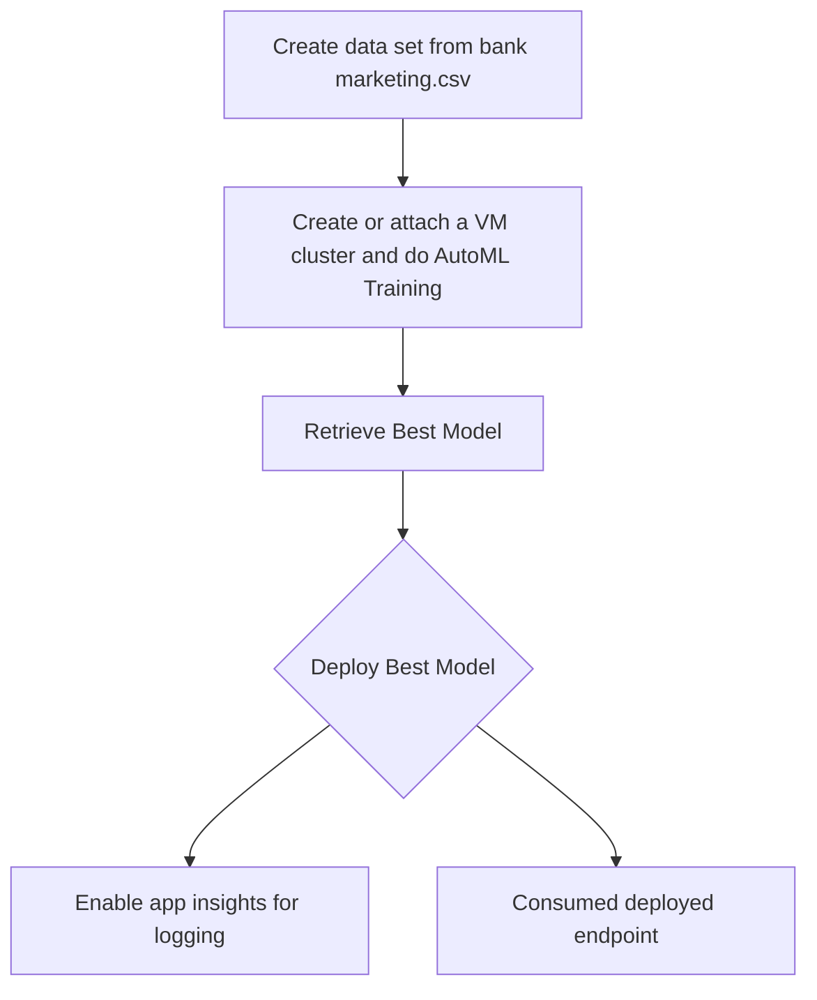
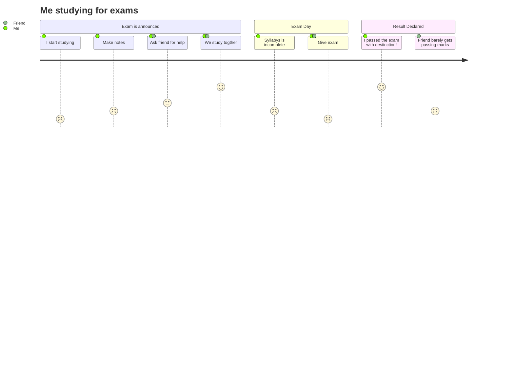

# Machine Learning Operations

In this project, Azure AutoML is used to produce a cloud-based machine learning production model with Bank Marketing data. The model could be used to predict if a client would subscribe to a term deposit. Steps are shown how the model is produced,deployed and consumed. Also a pipeline will be created, published and consumed.

## Architectural Diagram
*TODO*: Provide an architectual diagram of the project and give an introduction of each step. An architectural diagram is an image that helps visualize the flow of operations from start to finish. In this case, it has to be related to the completed project, with its various stages that are critical to the overall flow. For example, one stage for managing models could be "using Automated ML to determine the best model". 

### Here is a simple flow chart:   

   

### AutoML pipeline   

## Key Steps
*TODO*: Write a short discription of the key steps. Remeber to include all the screenshots required to demonstrate key steps. 

For AutoML, 
1. Create dataset from bank marketing csv data.

## Screen Recording
*TODO* Provide a link to a screen recording of the project in action. Remember that the screencast should demonstrate:

## Standout Suggestions
*TODO (Optional):* This is where you can provide information about any standout suggestions that you have attempted.
