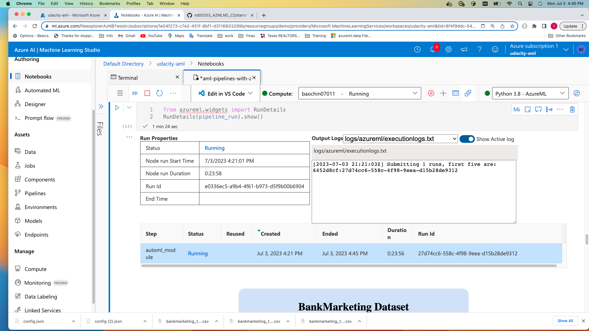

# Machine Learning Operations

In this project, Bank Marketing data is utilized to create a cloud-based machine learning model that predicts whether a client would subscribe to a term deposit. First AML Studio AutoML method is employed, showcasing the steps involved in generating,deploying, and consuming the best model. Also AML Python SDK is employed to construct and publish an AutoML pipeline. The published pipeline endpoint can be triggered to execute experiment runs. 
  
## Architectural Diagram
 

### Create experiment with AutoML and Deploy best model for consumption :   

  

### Create and Publish ML pipeline with SDK   

   

## Key Steps
 

## The following are steps to create and deploy AutoML best model:   

Created a dataset from downloaded bank marketing data.   

Executed AutoML run from AzureML Studio, and wait for the experiment run to complete.   

Examined the experiment run results and found out that VotingEnsemble is the best model.  

Deployed the best model, and enabled deployed endpoint Application Insights by running logs.py script.   

The deployed model endpoint.   

Downloaded deployed endpoint API swagger.json file, and ran locally to show the API HTTP methods and response.  

Retrieved the deployed endpoint information.   

Modified endpoint.py script with deployed endpoint URL and key, and ran the script to predict for two test clients. From model explaination, "duration" is the most important feature. Larger value (>1000) flip the result from 'no' to 'yes' for the first client.  

Used Apache Benchmark script benchmark.sh to get performance results.  

## The following are steps to create and publish ML pipeline:  

Using AML Python SDK, an AutoML pipeline was created.   

A "BankMarketing Dataset" was also created for the pipeline.  

Excuted the pipeline from Jupyter Notebook (see aml-pipelines-with-automated-machine-learning-step.ipynb), and published the pipeline.   

Used RunDetails Widget to show run information.  

Published the pipeline as "Bankmarketing Train" from Jupyter Notebook.   

Created script pipeline.py to interact with the the published pipeline endpoint to trigger an experiment "my-test-endpoint".   

  
## Screen Recording: 
### Click the following link 
  

## Standout Suggestions

1. Ran Apache Benchmark load test to check deployed endpoint performance. Screen capture is included above.

2. To make bulk tests/predictions more efficient for the deployed model, tried to create Parallel Run pipeline.
 
First Registered the best model from pipeline run as shown below (from aml-pipelines-with-automated-machine-learning-step.ipynb)   

 Then created files "parallel-run.ipynb" and "score.py".
 But when executing parallel-run.ipynb, got the following pipeline run log error   
 
 
 Would appreciate it if helping me to figure out the problem.

